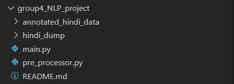
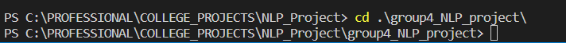
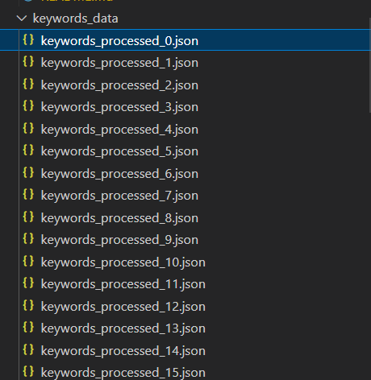
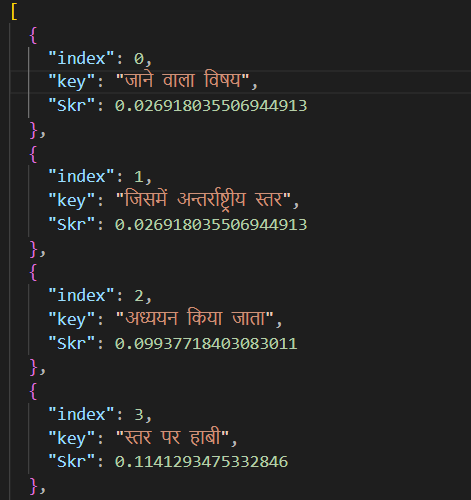
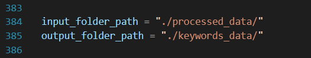
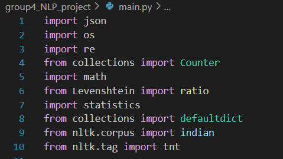
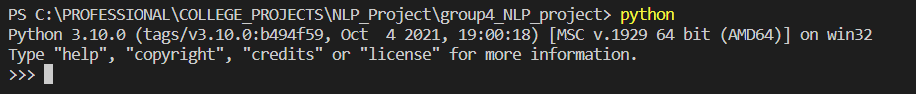
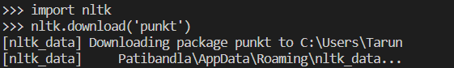

# POKE : Pankti Oriented Keyword Extractor ⚙️

---

## Contents

- [What is POKE?](#what-is-poke)
- [Usage Instructions](#usage-instructions)
- [Dataset Information](#dataset-info)
- [Troubleshooting](#troubleshooting)
- [Routes for further exploration](#further-exploration)
- [Meet the team behind POKE](#team-behind-poke)
- [References and other Important Information](#other-important-info)

## What is POKE 🤔?

- ***POKE*** (Performance Oriented Keyphrase Extractor, name subject to change) is a **Hindi Keyword Extracting Program.**  
- POKE is based on the *YAKE!* algorithm for keyword extraction. 
- POKE makes improvements and adjustments for superior performance for Hindi Language Keyphrase Extraction. 

## Usage Instructions 👩‍🔧

- The Project contains a .zip file named `group4_NLP_project.zip`.  (If this does not apply, click [this](#usage) and follow given instructions.)
- Extract the contents of the .zip file to a folder of choice. In this case, my folder is named `group4_NLP_project` , the same as the .zip file.  
- Once extracted, your folder structure should look something like this:  

- Once extracted, do the following:

1. Make sure your **current working directory** is set to the folder that you just extracted the contents of the zip file to. 
 
2. Run the `pre_processor.py` file first. This file pre processes the data and should create a folder named `processed_data` in the *current working directory.*  
3. Now run the `main.py` file. This should create a folder named `keywords_data` in the *current working directory*. Note that the newly created folder contains keyphrase data in **JSON format**. This allows for ease of further processing. 
 

### Further Instructions

- By default, the input folder path and output folder path of the `main.py` file are set to this: 

- Changes can be made to the input folder path and output folder path as one sees fit. Both `main.py` and `pre-processor.py` have input and output folder paths named `input_folder_path` and `outer_folder_path` respectively. These variables can easily be found with `Ctrl+F` on Windows, or `Cmd+F` on Mac and edited in any of the above files. 
- By Changing the `input_folder_path` variable of the `pre_processor.py` file to `./hindi_dump`, the noisy `hindi_dump` dataset can be used instead of the `annotated_hindi_data` dataset. Caution: There are thousands of files in the folder. Unexpected behavior or long wait times can be expected. 
- Some dependencies for smooth running of the code might not be installed in your system by default. In this case, follow the instructions that your CLI gives you: install each dependency by using `pip install <package-name>` to install relevant dependencies. 
- For reference, these are the import statements: 

- In case of any issues, refer to the [Troubleshooting Section](#troubleshooting)

## Dataset Information 🗂️

- This dataset was obtained from [this repository](https://github.com/banerjeeshubhanker/Hindi_Term-Extract). 
- From the above image, you may notice that the folder contains two subfolders, namely `annotated_hindi_data` and `hindi_dump`. 
- In `annotated_hindi_data` , there are two subfolders of importance: `annotations` and `data`. 
- `data` contains **71 .txt files** containing various hindi texts, while `annotations` also contains the same number of .txt files with line-seperated annotated keyphrases which correspond to the .txt in the `data` folder, with the same filename. For example, `4.txt` in `annotations` contains the annotated keywords of `4.txt` in `data`. 
- The folder `hindi_dump` contains about **3000 .txt files**  which have varying levels of noise and length. **This dataset contains noisy data**, unlike the `annotated_hindi_data` dataset.

## References and Other important Information 🔍

1. Library use in this project is kept minimal. However, libraries like **NLTK** have been used for *POS (Parts of Speech) Tagging*. 
2. It's optimal to use a **virtual environment** to run the code. [Check it out](https://www.dataquest.io/blog/a-complete-guide-to-python-virtual-environments/) 
3. This implementation of **POKE** is based on the *YAKE! algorithm paper*. For more details on implementation, [click this link.](https://www.sciencedirect.com/science/article/abs/pii/S0020025519308588) 
4. This implementation could be further optimized by the application of the concepts given in this paper, [PatternRank](https://arxiv.org/abs/2210.05245)
5. Further, more effective normalization , preprocessing techniques can be applied with [this paper](https://www.researchgate.net/publication/228596823_Hindi_Text_Normalization) as inspiration. This helped shape our implementation of normalization.
6. The bulk of our stopword list was obtained from [this paper](https://link.springer.com/article/10.1007/s11042-023-17205-9), which referenced [this github library](https://github.com/stopwords-iso/stopwords-hi) which contained the stopword lists. It must be noted that after multiple rounds of testing, we added many of our own stopwords to this list.

## Troubleshooting ⚒️

1. One might have trouble with installing the `punkt` and `indian` packages in nltk. 
2. To fix this, follow the below instructions: 
i. In your CLI, open the python shell by typing `python` into it. 

ii. Then, import the nltk library by entering `import nltk`. 
iii. You can then install the needed package by entering `nltk.download(<package-name>)`. 

iv. To quit the python terminal, use `quit()`.

## Possible Routes for further exploration 🧭

1. **PLMs** (Pretrained language models) proved to be effective for keyword extraction, as seen in the case of [KeyBERT](https://github.com/MaartenGr/KeyBERT). This calls for some implementation and exploration in that area. 
2. **LLMs** (Large Language Models) have been causing quite the buzz lately, with the introduction of **GPT** (Generative Pretrained Transformer) by *OpenAI*. With the usage of the *Langchain framework* and Possibly *Hindi LLMs*, there lies great potential for effective hindi keyword extraction.
3. Research on the effectiveness of PLMs for Keyword extraction can be done with [this paper](https://arxiv.org/abs/2212.10233) in mind.

## The team behind POKE 😎

🔸[Annabathini Swejan Chowdary](https://www.linkedin.com/in/annabathini-swejan-chowdary-799015299/) 
🔸[Parth Bhandari](https://www.linkedin.com/in/parth-bhandari-566667287/) 
🔸[Patibandla Venkata Chiranjeevi Tarun](https://www.linkedin.com/in/tarun-patibandla-47987a246/) 
